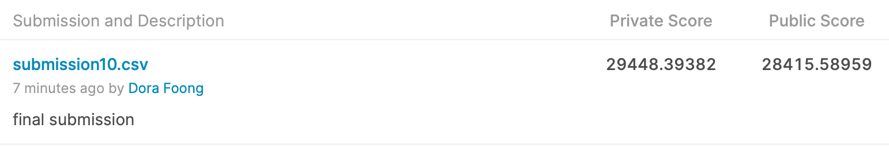

## Project 2: Prediction of Ames Housing Sale Price

### Problem Statement

This project examines a housing dataset from Ames, Iowa, USA. Ideally, the homeowners in Ames should be armed with data, such as the Ames housing dataset to maximise their property value, while buyers would make the best investment decision based on the available data when purchasing property. However, due to a lack of data, many homeowners overspend in trying to improve particular features of their home that do not translate to higher home value. Buyers may not get a bang for their buck when purchasing homes as they do not know which features (size, features, neighbourhood, etc) warrant a higher or lower home price. This could result in a financial loss for both homeowners and buyers. 

The Ames housing train dataset will be processed using linear regression models to find out which features in the dataset have a positive correlation to sale price. The goal of this project is to produce a model that can best predict sale prices based on the features in Ames housing test set. This model would provide homeowners with information on which parts of their home to improve to get a higher sale price. Buyers would also know which features are worth paying more for, enabling them to make better informed purchasing choices. 

### Executive Summary

The Ames housing train dataset comprises information on 81 home features.  These features broadly refer to the size, condition and quality of the house, number of rooms, type of home, key features (garage, basement, fireplace, pool, etc), significant dates (year built, sold, remodelled) and the neighbourhood it is located in. It also includes the sale price for each of the 2051 entries. The features are classified into numeric and categorical, and the latter can be subdivided into ordinal (quality assessments) and descriptive categories (neighbourhoods, etc).

To generate a good production model that can accurately predict sale prices of houses in Ames with an unseen dataset, I first conducted data cleaning and EDA on the train dataset, where I was able to gauge how each feature affected sale price. Following which, I conducted conducted features engineering by adding, dropping and tweaking features, as well as using one-hot encoding to convert the remaining categorical columns to numeric, so that modelling can take place. Subsequently, I used regularised models (Ridge and Lasso) to further narrow down to the best-performing features, i.e., the features will the highest coefficients for each model. After several iterations to pick the best combination of features that returned good r2 scores and RMSE, I ended up picking a list of 30 best-performing features to be included in the features matrix. I conducted Linear, Ridge, Lasso and Elastic Net regression modelling, before concluding that the Elastic Net regression produced a model that was the best at predicting sale prices. Lastly, I fit the final production model on the Ames housing dataset (which I processed in the same way as the Ames housing train set), to obtain the sale price predictions, which I submitted to the Kaggle competition.

As expected, the model showed that the square footage of the house affected the sale price most. Quality and condition of key features such as external areas, basement and kitchen also significantly affect the sale price. The ideal home type is also a single-storey house. I also found that generally, the younger the home, the higher the sale price and that Hillside homes commanded an additional premium. The most desirable neighbourhoods in Ames are Northridge Heights, Stone Brook and Northridge, due to their proximity to schools and amenities. The data also showed that fireplaces and brick exterior on homes also had a positive impact on sale price as Iowa experienced extremely frigid winters. Conversely, factors that would have a detrimental impact on sale price are having an unfinished home, a house having more than 3 bedrooms or the house type being a Townhouse. 

Accordingly, recommendations for homeowners to improve the value of their homes would be to make sure it is in a livable condition, improving the quality of features such as kitchen, basements and external areas, as well as installing fireplaces or even a brick exterior to improve liveability during wintertime.  Buyers should wanting to make good investments in the Ames housing market should purchase newly built, single-storey homes with 2 or 3 bedrooms, in the neighbourhoods of Northridge Heights, Stone Brooks or Northridge. Homes with fireplaces and brick exteriors would be an added bonus for the property's value.

### Contents
- [EDA and Cleaning](./code/1_EDA_and_Cleaning.ipynb)
- [Preprocessing and Feature Engineering](./code/2_Preprocessing_and_Feature_Engineering.ipynb)
- [Model Benchmarks](./code/3_Model_Benchmarks.ipynb)
- [Model Tuning](./code/4_Model_Tuning.ipynb)
- [Production Model and Insights](./code/5_Production_Model_and_Insights.ipynb)

### Data Dictionary
The data dictionary can be found in this [link](https://www.kaggle.com/c/dsi-us-6-project-2-regression-challenge/data) 

### Kaggle Submission Score

### Recommendations 

#### Homeowners looking to increase the value of their property could carry out the following renovations:
- Improving the quality and condition of key home features such as the external areas (i.e., lawn, porch, etc), basement and kitchen 
- Making sure the home is in a finished condition, ideally in a move-in state when selling 
- Installing features that would keep the house warm during freezing winters, such as fireplaces in the home and a brick exterior for better insulation

#### Considerations for buyers looking to purchase a house in Ames:
- Ideal neighbourhoods to purchase homes in are Northridge Heights, Stone Brookes or Northridge, which would give better returns on property investments
- Homes with large square footage and in good, finished condition will command a higher price
- Single-storey homes have better sale price psf than other types of homes, while townhouses have the lowest value psf. 
- Homes with 2- or 3- bedrooms are ideal, any more bedrooms could decrease the home value
- Look for homes with fireplaces and brick exteriors which could increase the home value, while the presence of masonry veneer could decrease the home value
- Younger homes have higher value

